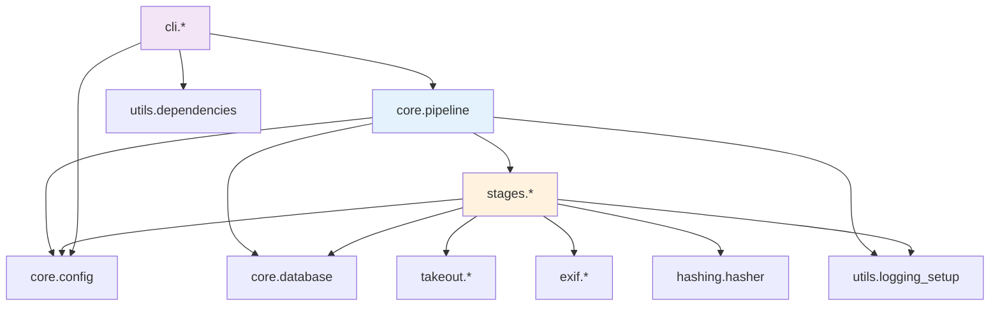

# Architecture Documentation

Design decisions, module structure, and extension points for takeout-photos.

---

## Table of Contents

- [Design Principles](#design-principles)
- [Module Structure](#module-structure)
- [Database Schema](#database-schema)
- [Key Design Decisions](#key-design-decisions)
- [Extension Points](#extension-points)
- [Performance Optimizations](#performance-optimizations)

---

## Design Principles

### 1. Modular Architecture

The modular refactoring transformed a monolithic script into a clean, modular package:

**Benefits:**

- **Testability**: Each module independently testable (231 tests)
- **Maintainability**: Clear separation of concerns
- **Reusability**: Use as library or CLI
- **Extensibility**: Add new stages without touching existing code

### 2. Stateless Operations

All pipeline state lives in the database, not in memory:

```python
# Each stage is a pure function
def step_X(config: Config, db: PipelineDB, ..., log: logging.Logger) -> None:
    # Read state from DB
    # Perform operation
    # Write state to DB
    # No in-memory state
```

**Benefits:**

- Resumable after interruption
- No state corruption from crashes
- Parallel processing safe
- Easy to reason about

### 3. Batch Operations

Minimize process overhead by batching operations:

```python
# Bad: N exiftool processes
for file in files:
    subprocess.run(["exiftool", "-DateTimeOriginal=...", file])

# Good: 1 exiftool process
args_file = create_batch_args(files)
subprocess.run(["exiftool", "-@", args_file])
```

**Performance Impact:**

- Before: 200K files × 100ms/process = 5.5 hours in process creation
- After: 1 batch process = seconds

### 4. Idempotent Stages

Every stage can be safely re-run:

```python
# Extract stage checks if already extracted
if zip.status == "extracted":
    return  # Skip, already done

# Hash stage checks if hash exists
if file.content_hash is not None:
    continue  # Skip, already hashed
```

**Benefits:**

- Resume from any interruption
- Retry failed operations
- No duplicate work

---

## Module Structure

```
takeout_photos/
├── core/                      # Core infrastructure
│   ├── config.py             # Configuration dataclass
│   ├── constants.py          # Shared constants
│   ├── database.py           # SQLite operations
│   └── pipeline.py           # Pipeline orchestrator
│
├── stages/                    # Processing stages
│   ├── extract.py            # Phase 1: ZIP extraction
│   ├── validate.py           # Phase 1b: Format validation
│   ├── metadata.py           # Phase 2: EXIF metadata
│   ├── hash.py               # Phase 3: Content hashing
│   ├── dedupe.py             # Inline dedupe helper (used by organize)
│   ├── organize.py           # Phase 4: Organization + inline deduplication
│   └── qc.py                 # Phase 5: Quality control
│
├── takeout/                   # Google Takeout specifics
│   ├── json_parser.py        # Parse Takeout JSON
│   └── json_finder.py        # Locate JSON files
│
├── exif/                      # EXIF operations
│   ├── operations.py         # exiftool wrapper
│   ├── format_detection.py  # File format detection
│   └── validation.py         # Date validation
│
├── hashing/                   # Content hashing
│   └── hasher.py             # xxhash/SHA256
│
├── cli/                       # Command-line interface
│   ├── commands.py           # Command implementations
│   └── main.py               # Argparse and dispatch
│
└── utils/                     # Shared utilities
    ├── logging_setup.py      # Logging configuration
    ├── progress.py           # Progress bars
    └── dependencies.py       # Dependency checking
```

### Module Responsibilities

| Module | Responsibility | Key Functions |
|--------|----------------|---------------|
| **core.config** | Configuration management | Config dataclass, path resolution |
| **core.database** | State persistence | CRUD operations, queries, indexing |
| **core.pipeline** | Orchestration | Coordinate all stages, manage state |
| **stages.*** | Processing stages | 6 stage functions + inline dedupe helper |
| **takeout.*** | Google Takeout parsing | JSON extraction, pattern matching |
| **exif.*** | EXIF operations | exiftool wrapper, format detection |
| **hashing.hasher** | Content hashing | xxhash/SHA256, parallel hashing |
| **cli.*** | User interface | Argparse, command dispatch |
| **utils.*** | Shared utilities | Logging, progress, dependency checks |

### Dependency Graph



**Design Note:** Stages depend on infrastructure (config, database) but not on each other. This enables independent testing and parallel development.

---

## Database Schema

### Tables

```sql
-- ZIP processing state
CREATE TABLE zips (
    name TEXT PRIMARY KEY,
    status TEXT NOT NULL,          -- pending, extracting, extracted, processing, organized, error
    file_count INTEGER,
    extracted_at TEXT,
        staged_at TEXT,                -- legacy (kept for compatibility)
    deleted_at TEXT,
    error_msg TEXT
);

-- Media file registry
CREATE TABLE files (
    id INTEGER PRIMARY KEY,
    zip_name TEXT,
    original_path TEXT,
    content_hash TEXT,
    file_size INTEGER,
    has_json INTEGER DEFAULT 0,
    json_path TEXT,

    -- Metadata extracted from JSON
    photo_taken_ts INTEGER,
    geo_lat REAL,
    geo_lon REAL,

    -- Final EXIF data
    exif_datetime TEXT,
    exif_has_gps INTEGER DEFAULT 0,

    -- Processing state
    status TEXT DEFAULT 'pending',  -- pending, meta_applied, organized, error
    staged_path TEXT,               -- legacy (kept for compatibility)
    final_path TEXT,

    -- QC flags
    qc_no_date INTEGER DEFAULT 0,
    qc_suspicious_date INTEGER DEFAULT 0,
    qc_future_date INTEGER DEFAULT 0,

    UNIQUE(zip_name, original_path)
);

-- JSON file lookups (indexed)
CREATE TABLE json_files (
    id INTEGER PRIMARY KEY,
    zip_name TEXT,
    filename TEXT,
    full_path TEXT,
    base_media_name TEXT,
    UNIQUE(zip_name, full_path)
);

-- Organized files (dedupe across runs)
CREATE TABLE organized_files (
    hash TEXT PRIMARY KEY,
    original_name TEXT NOT NULL,
    final_path TEXT NOT NULL,
    organized_at TEXT NOT NULL,
    source_zip TEXT NOT NULL,
    file_size INTEGER
);

-- Recovery audit log
CREATE TABLE recovery_log (
    id INTEGER PRIMARY KEY AUTOINCREMENT,
    timestamp TEXT NOT NULL,
    recovery_type TEXT NOT NULL,
    affected_count INTEGER DEFAULT 0,
    details TEXT,
    resolved INTEGER DEFAULT 1
);

-- Global pipeline state
CREATE TABLE pipeline_state (
    key TEXT PRIMARY KEY,
    value TEXT
);
```

### Indexes

Critical indexes for performance:

```sql
-- Fast file lookups
CREATE INDEX idx_files_zip ON files(zip_name);
CREATE INDEX idx_files_status ON files(status);
CREATE INDEX idx_files_hash ON files(content_hash);

-- Fast JSON lookups (Phase 1)
CREATE INDEX idx_json_base_name ON json_files(base_media_name);

-- Fast organized file checks (dedupe)
CREATE INDEX idx_organized_hash ON organized_files(hash);
CREATE INDEX idx_organized_zip ON organized_files(source_zip);
```

### State Transitions

**ZIP status flow:**

```
pending → extracting → extracted → processing → organized
                                      ↓
                                    error (recoverable)
```

**File status flow:**

```
pending → meta_applied → organized (or error)
```

---

## Key Design Decisions

### 1. Why SQLite?

**Decision:** Use SQLite for state management instead of files or in-memory structures.

**Rationale:**

- **Atomicity**: Transactions prevent partial updates
- **Queryability**: SQL queries for complex operations (deduplication, QC)
- **Persistence**: State survives crashes and restarts
- **Performance**: Fast for our use case (<1M records)
- **Simplicity**: No external database server required

**Alternative Considered:** JSON files

- ❌ No atomicity (corruption risk)
- ❌ No efficient queries (must load entire file)
- ❌ No concurrency support

### 2. Why Global Deduplication?

**Decision:** Deduplicate across ALL ZIPs using content hashes, inline during organization.

**Rationale:**
Google Takeout exports contain duplicates:

- Same photo in multiple albums
- Re-exported photos in incremental exports
- Edited versions alongside originals

Per-ZIP deduplication would miss these cases.

**Trade-off:**

- ✅ Finds all duplicates (across runs via `organized_files`)
- ⚠️ Requires a global lookup during organization
- ⚠️ Slightly more complex logic

### 3. Why Batch exiftool?

**Decision:** Use exiftool's `-@` flag for batch operations instead of per-file execution.

**Rationale:**
Process creation overhead dominates for small operations:

- **Per-file**: 200K files × 100ms = 5.5 hours just in process overhead
- **Batch**: 1 process = seconds

**Implementation:**

```python
# Create args file
with open("args.txt", "w") as f:
    for file, metadata in files_and_metadata:
        f.write(f"-DateTimeOriginal={metadata['date']}\n")
        f.write(f"{file}\n")

# Single exiftool invocation
subprocess.run(["exiftool", "-@", "args.txt"])
```

### 4. Why Two-Phase JSON Lookup?

**Decision:** Register all JSON files in indexed table (Phase 1), then look up during extraction.

**Rationale:**
**Before (v1):**

```python
# Search filesystem for each media file
json_path = find_json_for_media(media_file)  # Slow: filesystem traversal
```

**After (optimized):**

```python
# Register JSON files once
db.register_json_file(json_path)  # Indexed by base_media_name

# Fast database lookup
json_path = db.find_json_for_media_db(media_file)  # Fast: indexed query
```

**Performance:**

- Before: O(N×M) filesystem searches (N media files × M JSON files)
- After: O(N) database lookups with index

### 5. Why Modular Package?

**Decision:** Transform monolithic script into installable package.

**Rationale:**

- **Distribution**: `pip install takeout-photos` (not copy script)
- **Library API**: Use as Python library
- **Testing**: Comprehensive test suite (231 tests)
- **Maintainability**: Clear module boundaries
- **Professionalism**: Modern Python packaging standards

**Trade-offs:**

- ✅ Better code quality
- ✅ More flexible usage
- ⚠️ More complex project structure
- ⚠️ Steeper learning curve for contributors

---

## Extension Points

### 1. Custom Processing Stages

Add new stages to the pipeline:

```python
from takeout_photos.core.config import Config
from takeout_photos.core.database import PipelineDB
import logging

def step_custom(
    config: Config,
    db: PipelineDB,
    log: logging.Logger
) -> None:
    """Custom processing stage."""
    log.info("Running custom stage...")

    # Get files from database
    files = db.conn.execute("SELECT * FROM files WHERE status = 'meta_applied'").fetchall()

    # Your custom logic here
    for file in files:
        # Process file
        pass

    db.commit()

# Use in pipeline
from takeout_photos import Pipeline

pipeline = Pipeline(config)
pipeline.extract_all_zips()
pipeline.validate_formats()
step_custom(config, pipeline.db, pipeline.log)  # Insert custom stage
pipeline.run()
```

### 2. Alternative Hash Algorithms

Swap hash algorithm:

```python
# In hashing/hasher.py
def compute_hash(filepath: Path) -> str:
    # Option 1: Use BLAKE2 (faster than SHA256)
    import hashlib
    h = hashlib.blake2b()

    # Option 2: Use BLAKE3 (even faster)
    import blake3
    h = blake3.blake3()

    with open(filepath, "rb") as f:
        while chunk := f.read(65536):
            h.update(chunk)

    return h.hexdigest()
```

### 3. Alternative JSON Parsers

Support custom JSON formats:

```python
# In takeout/json_parser.py
def parse_custom_json(json_path: Path) -> dict[str, Any]:
    """Parse custom JSON format."""
    with open(json_path) as f:
        data = json.load(f)

    # Custom parsing logic
    return {
        "photo_taken_ts": ...,
        "geo_lat": ...,
        "geo_lon": ...,
    }

# Register parser
from takeout_photos.takeout import json_parser
json_parser.parse_takeout_json = parse_custom_json
```

### 4. Custom QC Checks

Add custom quality control checks:

```python
def custom_qc_check(config: Config, db: PipelineDB) -> list[str]:
    """Custom QC check."""
    issues = []

    # Example: Check for very large files
    large_files = db.conn.execute(
        "SELECT * FROM files WHERE file_size > ?",
        (100 * 1024 * 1024,)  # 100MB
    ).fetchall()

    if large_files:
        issues.append(f"Found {len(large_files)} files > 100MB")

    return issues

# Use in QC stage
from takeout_photos.stages import qc
original_qc = qc.step_qc

def enhanced_qc(config, db, log):
    original_qc(config, db, log)
    custom_issues = custom_qc_check(config, db)
    for issue in custom_issues:
        log.warning(issue)

qc.step_qc = enhanced_qc
```

### 5. Custom Organizat Layouts

Add custom directory layouts:

```python
# In stages/organize.py
def custom_organize_layout(date: str, config: Config) -> Path:
    """Custom organization layout."""
    year = date[:4]
    month = date[5:7]
    day = date[8:10]

    # Custom: YYYY/YYYY-MM-DD/
    return config.final_dir / year / f"{year}-{month}-{day}"

# Use custom layout
from takeout_photos.stages import organize
organize.get_target_dir = custom_organize_layout
```

---

## Performance Optimizations

### 1. Parallel Hashing

Use all CPU cores for hashing (Phase 2b):

```python
from concurrent.futures import ProcessPoolExecutor

with ProcessPoolExecutor(max_workers=config.workers) as executor:
    results = executor.map(compute_hash, file_paths)
```

**Impact:** 8 workers = ~8x speedup for CPU-bound hashing

### 2. Batch exiftool Operations

Single process for all files (Phase 2 metadata and QC scans):

```python
# Create args file with all operations
with open("args.txt", "w") as f:
    for file, metadata in files_and_metadata:
        f.write(f"-DateTimeOriginal={metadata['date']}\n")
        f.write(f"{file}\n")

# Single execution
subprocess.run(["exiftool", "-@", "args.txt"])
```

**Impact:** 1000 files in ~30 seconds vs ~90 minutes per-file

### 3. Indexed JSON Lookups

Database index on `base_media_name` (Phase 1):

```sql
CREATE INDEX idx_json_base_name ON json_files(base_media_name);
```

**Impact:** O(1) lookups vs O(N) filesystem scans

### 4. xxhash Algorithm

Fast non-cryptographic hash (Phase 2b):

```python
import xxhash  # pip install xxhash

h = xxhash.xxh64()  # 2-3x faster than SHA256
```

**Impact:** 2-3x faster hashing, ~1 hour saved for 200K photos

### 5. Streaming File I/O

Read files in chunks, not all at once:

```python
with open(filepath, "rb") as f:
    while chunk := f.read(65536):  # 64KB chunks
        h.update(chunk)
```

**Impact:** Constant memory usage regardless of file size

---

## Testing Strategy

### Test Coverage

| Module | Coverage | Test Type |
|--------|----------|-----------|
| core/ | 85%+ | Unit + Integration |
| stages/ | 80%+ | Unit + Integration |
| takeout/ | 90%+ | Unit |
| exif/ | 85%+ | Unit |
| hashing/ | 90%+ | Unit |
| cli/ | 60%+ | Integration |
| utils/ | 90%+ | Unit |

### Test Types

**Unit Tests (fast, isolated):**

```python
def test_parse_json():
    """Test JSON parsing."""
    data = parse_takeout_json(Path("test.json"))
    assert data["photo_taken_ts"] == 1234567890
```

**Integration Tests (multi-component):**

```python
def test_full_pipeline(tmp_path):
    """Test complete pipeline."""
    config = Config(workdir=tmp_path)
    pipeline = Pipeline(config)
    pipeline.run()
    assert config.db_path.exists()
```

### Key Test Cases

**JSON Finder:**

- All 18 pattern variants
- 46-character truncation
- Numbered suffixes: (1), (2)
- Global search across ZIPs

**Database:**

- Schema creation
- CRUD operations
- JSON file lookup performance
- Deduplication queries

**Pipeline:**

- End-to-end with sample ZIP
- Resume from checkpoint
- Error handling

---

## Security Considerations

### 1. Path Traversal Prevention

Validate all file paths:

```python
def safe_extract(zip_file, target_dir):
    """Extract ZIP with path validation."""
    for member in zip_file.namelist():
        # Prevent ../../../etc/passwd
        if ".." in member or member.startswith("/"):
            raise ValueError(f"Unsafe path: {member}")
```

### 2. SQL Injection Prevention

Use parameterized queries:

```python
# Safe
db.execute("SELECT * FROM files WHERE zip_name = ?", (name,))

# Unsafe
db.execute(f"SELECT * FROM files WHERE zip_name = '{name}'")
```

### 3. Command Injection Prevention

Never use shell=True:

```python
# Safe
subprocess.run(["exiftool", "-DateTimeOriginal=...", file])

# Unsafe
subprocess.run(f"exiftool -DateTimeOriginal=... {file}", shell=True)
```

### 4. File Permission Checks

Verify file access before operations:

```python
if not file_path.exists():
    raise FileNotFoundError(f"File not found: {file_path}")

if not os.access(file_path, os.R_OK):
    raise PermissionError(f"Cannot read file: {file_path}")
```

---

## See Also

- [API Reference](api.md) - Complete API documentation
- [Pipeline Flow](pipeline-flow.md) - Visual flowcharts for each stage
- [README](../README.md) - Getting started and overview
