# Pipeline Flow Diagrams

Visual flowcharts for each stage of the Google Photos Takeout processing pipeline.

---

## Table of Contents

- [Pipeline Flow Diagrams](#pipeline-flow-diagrams)
  - [Table of Contents](#table-of-contents)
  - [Complete Pipeline Overview](#complete-pipeline-overview)
  - [Phase 1: ZIP Extraction](#phase-1-zip-extraction)
  - [Phase 1b: Format Validation](#phase-1b-format-validation)
  - [Phase 2: Metadata Application](#phase-2-metadata-application)
  - [Phase 3: Content Hashing](#phase-3-content-hashing)
  - [Phase 4: Organization + Inline Deduplication](#phase-4-organization--inline-deduplication)
  - [Phase 5: Quality Control](#phase-5-quality-control)
  - [Database State Transitions](#database-state-transitions)
  - [Performance Characteristics](#performance-characteristics)
  - [Error Recovery](#error-recovery)
  - [Recovery System](#recovery-system)
  - [See Also](#see-also)

---

## Complete Pipeline Overview

High-level view of the entire pipeline processing flow.

```mermaid
flowchart TD
    START([Start: ZIPs in zips/]) --> PHASE1[Phase 1: Extract ZIPs]
    PHASE1 --> |extracted/| PHASE1B[Phase 1b: Validate Formats]
    PHASE1B --> PHASE2[Phase 2: Apply Metadata]
    PHASE2 --> PHASE3[Phase 3: Compute Hashes]
    PHASE3 --> PHASE4[Phase 4: Organize + Inline Dedup]
    PHASE4 --> |organized_dir/| PHASE5[Phase 5: Quality Control]
    PHASE5 --> |logs/qc_*.txt| END([Complete])

    style START fill:#e1f5e1,color:#333333
    style END fill:#ffe1e1,color:#333333
    style PHASE1 fill:#e3f2fd,color:#333333
    style PHASE1B fill:#e3f2fd,color:#333333
    style PHASE2 fill:#fff3e0,color:#333333
    style PHASE3 fill:#fff3e0,color:#333333
    style PHASE4 fill:#f3e5f5,color:#333333
    style PHASE5 fill:#e0f2f1,color:#333333
```

**Processing Model:**

- **Phase 1**: Merge-extract all ZIPs to a shared `extracted/` directory
- **Phases 1b-4**: Per-ZIP processing (validate → metadata → hash → organize + inline dedupe)
- **Phase 5**: Global QC report (run once at end)

---

## Phase 1: ZIP Extraction

Extract ZIP files and register media files with associated JSON metadata.

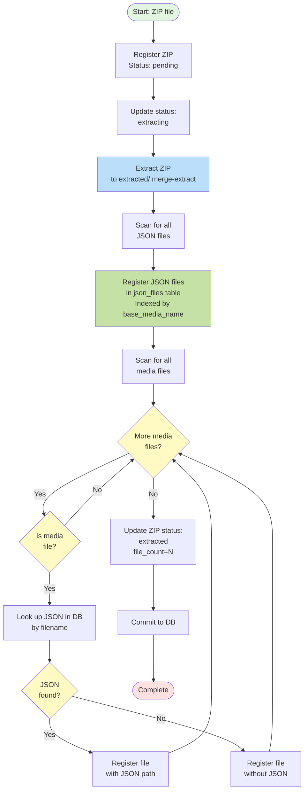

**Key Operations:**

1. Extract ZIP to shared `extracted/` directory (merge-extract)
2. Validate paths to prevent Zip Slip attacks (rejects `../` and absolute paths)
3. Handle path collisions with checksum comparison (rename conflicts with `_conflict_N` suffix)
4. Register all JSON files for fast lookup (indexed table)
5. Register media files with associated JSON paths
6. Update ZIP status: `pending` → `extracting` → `extracted`

**Security & Safety:**

- Path traversal protection prevents malicious ZIPs from writing outside extraction directory
- Checksum-based collision detection prevents data loss when different ZIPs have files with same paths

**Database Tables Used:**

- `zips`: Track extraction state
- `json_files`: Indexed JSON file lookups
- `files`: Media file registry

---

## Phase 1b: Format Validation

Validate file formats and correct mismatched extensions using parallel workers.

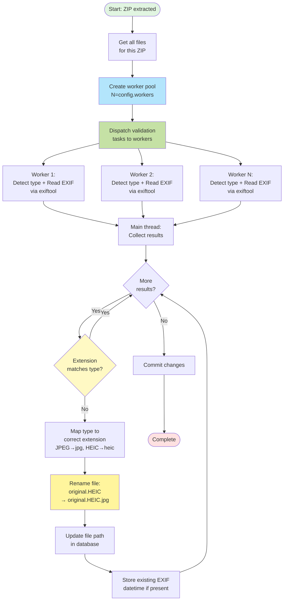

**Key Operations:**

1. Create ProcessPoolExecutor with N workers (configurable via `config.workers`)
2. Dispatch file validation tasks to parallel workers (I/O-bound exiftool calls)
3. Workers detect real file type and read EXIF metadata in a single exiftool call
4. Main thread collects results and handles file renaming (avoids race conditions)
5. Correct extension if mismatched: `IMG_6486.HEIC` → `IMG_6486.HEIC.jpg`
6. Update database with corrected paths
7. Store existing EXIF datetime for comparison

**Parallelization:**

- Uses ProcessPoolExecutor for parallel exiftool subprocess calls
- 3-4x speedup on I/O-bound file type detection operations
- Worker pool size configurable (default: 4 workers)
- Main thread handles file renaming to prevent race conditions

**Common Corrections:**

- `.HEIC` → `.jpg` (HEIC files that are actually JPEG)
- `.PNG` → `.jpg` (PNG files that are actually JPEG)

---

## Phase 2: Metadata Application

Apply JSON metadata to EXIF tags using batch exiftool operations with validation.

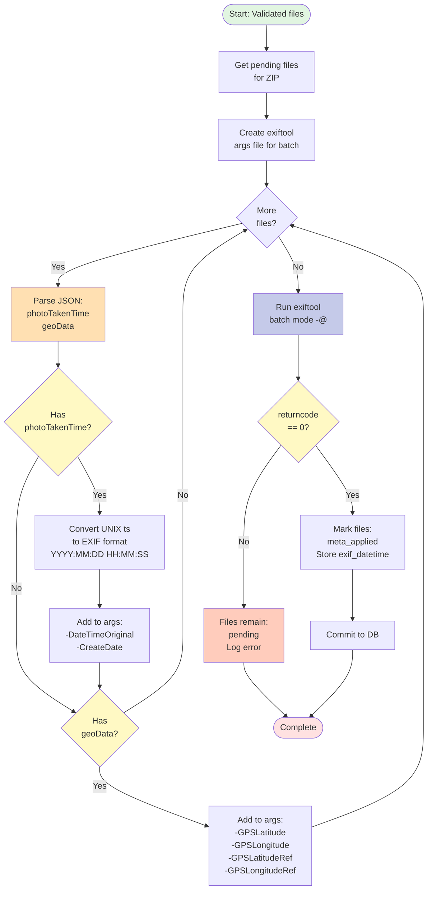

**Key Operations:**

1. Retrieve all pending files for the ZIP
2. Parse JSON for `photoTakenTime` and `geoData`
3. Generate exiftool arguments file (batch mode)
4. Execute single exiftool command for all files
5. Validate exiftool return code
6. If success (returncode=0): Mark files as `meta_applied`, store `exif_datetime`
7. If failure: Files stay `pending` for automatic retry

**Why Batch Mode:**

- 1 exiftool process for N files (not N processes)
- 10x+ faster than per-file execution
- Typical: 30-60 seconds for 1000 files

**EXIF Tags Written:**

- `DateTimeOriginal`: From JSON `photoTakenTime`
- `CreateDate`: Same as DateTimeOriginal
- `GPSLatitude`, `GPSLongitude`: From JSON `geoData`
- `GPSLatitudeRef`, `GPSLongitudeRef`: N/S, E/W based on coordinate signs

**Idempotency & Retry:**

- Validation ensures files only advance on success
- exiftool failures leave files in `pending` state
- Next run automatically retries failed files
- Prevents partial metadata corruption from crashes

---

## Phase 3: Content Hashing

Compute content hashes for deduplication using parallel workers.

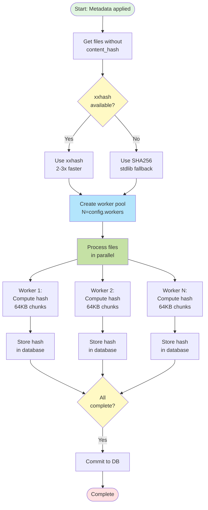

**Key Operations:**

1. Identify files without content hashes
2. Select hash algorithm (xxhash or SHA256)
3. Create ProcessPoolExecutor with N workers
4. Compute hashes in parallel (CPU-bound)
5. Store hashes in database
6. Mark files as `status='error'` if hashing fails (file deleted, permissions, I/O errors)

**Hash Algorithm Selection:**

| Algorithm | Speed | Digest | Use |
| --- | --- | --- | --- |
| xxhash | 2-3x faster | 16 chars | Preferred |
| SHA256 | Baseline | 64 chars | Fallback |

**Performance:**

- For 1000 files @ 2MB each with 8 workers:
  - xxhash: ~30 seconds
  - SHA256: ~90 seconds

---

## Phase 4: Organization + Inline Deduplication

Organize files into the final directory structure and deduplicate inline using transactional DB-before-move pattern.

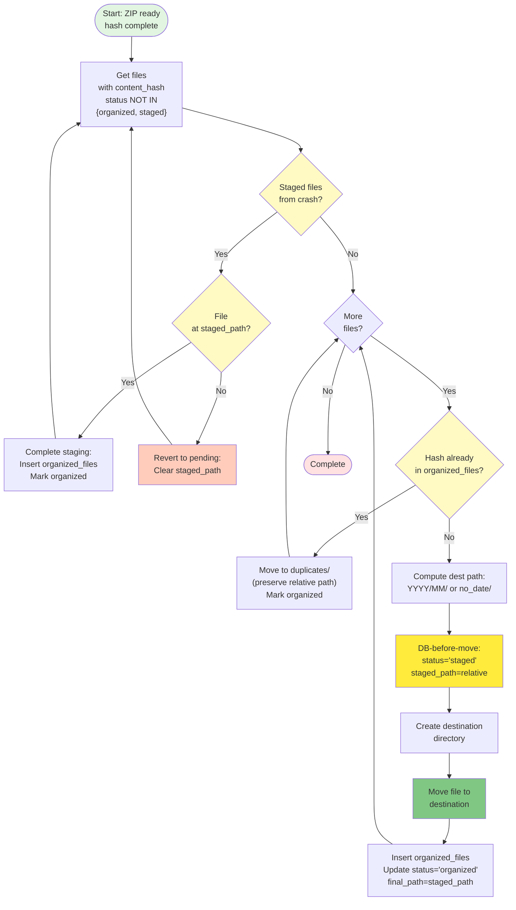

**Key Operations:**

1. **Recovery**: Check for staged files from previous crash
   - If file exists at `staged_path`: Complete staging → `organized`
   - If file missing: Revert to `pending` for retry
2. Iterate files with hashes for a ZIP
3. Skip files with `status='organized'` or `status='staged'` (retry support)
4. If hash exists in `organized_files`, move to `duplicates/`
5. **DB-before-move pattern** (crash-safe):
   - Compute destination path
   - Mark `status='staged'`, store `staged_path` in DB
   - Move file to destination
   - Insert into `organized_files`, mark `status='organized'`
   - Commit per batch (recovery detects `staged` files after a crash)
6. Track errors and mark ZIP as `'error'` if any files fail

**Idempotency & Crash Safety:**

- Files with `status='organized'` or `status='staged'` are skipped
- Local recovery: staged files from previous run are detected and completed/reverted
- DB-before-move ensures crash-safety (database tracks intent before filesystem change)
- Failed files can be retried without re-processing successful ones
- Prevents moving already-organized files to duplicates/ on subsequent runs

**Organization Layouts:**

| Layout | Example Path |
| --- | --- |
| `yyyy/mm` (default) | `organized_dir/2023/05/photo.jpg` |
| `no_date` (no EXIF date) | `organized_dir/no_date/photo.jpg` |

**Crash Scenarios:**

| Crash Point | DB State | Filesystem | Recovery |
| --- | --- | --- | --- |
| Before staging | `pending` | In extracted/ | Retry organize |
| After staging, before move | `staged` | In extracted/ | Revert to `pending` |
| After move, before finalize | `staged` | In organized/ | Complete: mark `organized` |
| After finalize | `organized` | In organized/ | Skip (already done) |

---

## Phase 5: Quality Control

Generate quality control report identifying potential metadata issues.

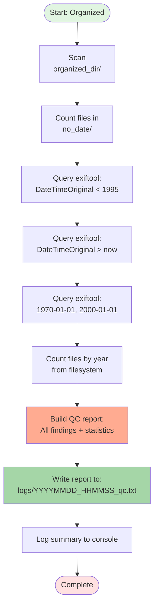

**Key Operations:**

1. Find files without DateTimeOriginal (in `no_date/`)
2. Detect suspiciously old dates (< 1995)
3. Detect future dates (> today)
4. Detect suspicious epoch dates (1970-01-01, 2000-01-01)
5. Generate statistics by year
6. Write comprehensive report to `logs/YYYYMMDD_HHMMSS_qc.txt`

**QC Report Contents:**

| Section | Description |
| --- | --- |
| **No Date** | Files in `no_date/` directory |
| **Very Old** | Dates before 1995 (unlikely) |
| **Future Dates** | Dates after today (incorrect clock) |
| **Suspicious** | Epoch dates (1970-01-01, 2000-01-01) |
| **Statistics** | File count by year |

**Use Cases:**

- Identify files needing manual date correction
- Verify pipeline processed files correctly
- Generate statistics for reporting
- Detect metadata corruption or export issues

---

## Database State Transitions

How each phase updates the database state:

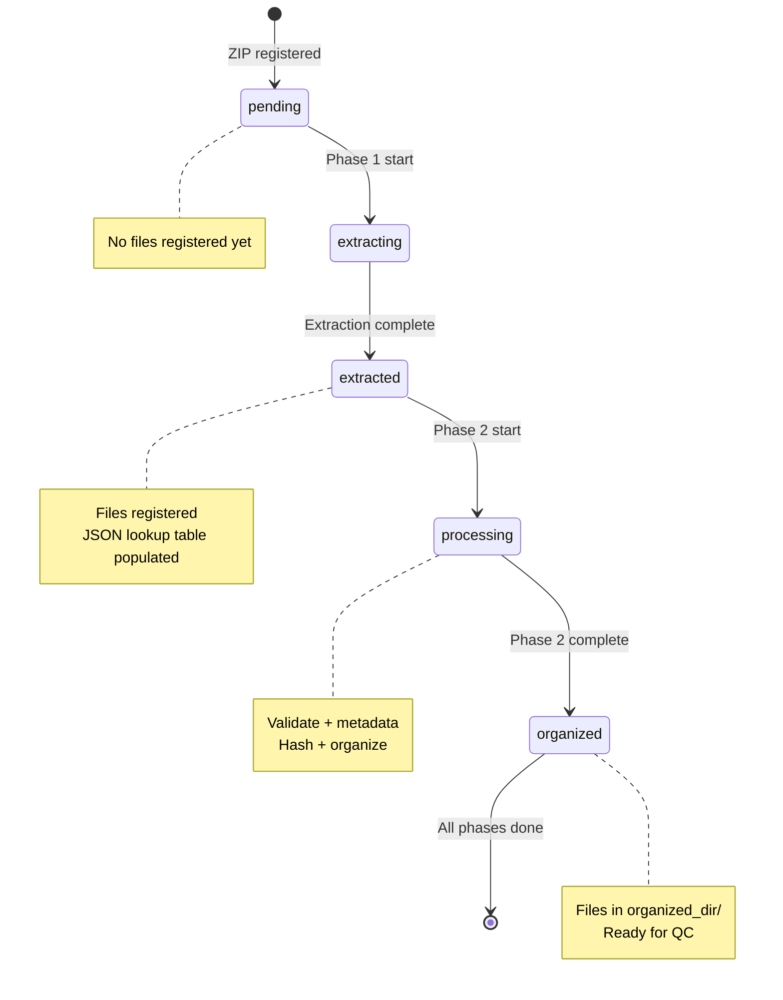

**File Status Transitions:**

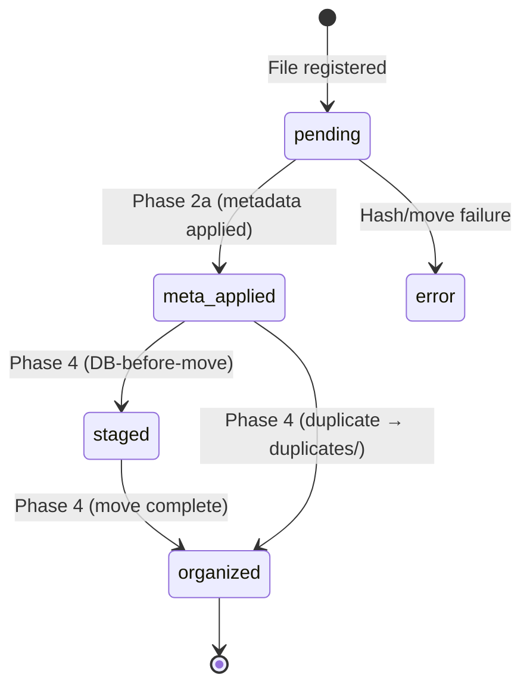

---

## Performance Characteristics

Expected duration for each phase (200K photos, ~50GB, SSD):

| Phase | Duration | Bottleneck | Parallelizable |
| --- | --- | --- | --- |
| **1: Extract** | 30-60 min | I/O (disk read) | Per ZIP |
| **1b: Validate** | 5-7 min | exiftool calls (I/O-bound) | ✅ Per file (ProcessPoolExecutor) |
| **2: Metadata** | 20-40 min | exiftool batch | Per ZIP |
| **3: Hash** | 30-60 min | CPU (hashing) | ✅ Per file (ProcessPoolExecutor) |
| **4: Organize + Dedupe** | 30-60 min | I/O (move) | Per ZIP |
| **5: QC** | 1-5 min | exiftool scans | No |
| **Total** | **2-4 hours** | --- | --- |

**Optimization Opportunities:**

1. **Install xxhash**: 2-3x faster hashing (Phase 3)
2. **Use SSD**: 10x+ faster I/O (all phases)
3. **Adjust workers**: Match CPU cores (Phases 1b, 3 use `config.workers`)
4. **Process in parallel**: Run multiple ZIPs through Phases 1-4 simultaneously (when safe)

**Parallelized Phases:**

- **Phase 1b (Validate)**: Uses ProcessPoolExecutor for parallel exiftool calls (3-4x speedup)
- **Phase 3 (Hash)**: Uses ProcessPoolExecutor for parallel content hashing (N-worker speedup)

---

## Error Recovery

How the pipeline handles failures at each stage:

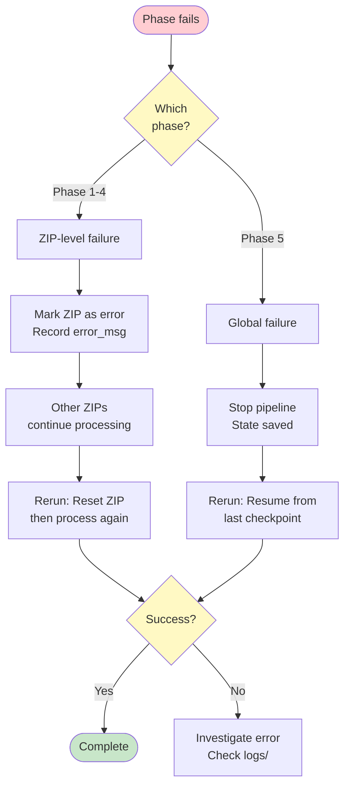

**Recovery Commands:**

```bash
# Reset failed ZIP
takeout-photos --workdir ~/work reset --zip takeout-003.zip

# Resume processing
takeout-photos --workdir ~/work process
```

---

## Recovery System

Automatic recovery runs at pipeline startup to detect and fix inconsistencies from crashes or interruptions.

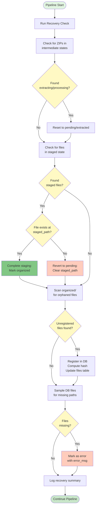

**Recovery Operations:**

1. **Intermediate ZIPs**: Reset stuck states
   - `extracting` → `pending` (re-extract)
   - `processing` → `extracted` (re-process)

2. **Staged Files**: Complete or revert (see Phase 4 crash scenarios)
   - File at `staged_path`: Complete staging → `organized`
   - File missing: Revert to `pending` for retry

3. **Orphaned Organized Files**: Register in database
   - Scan `organized/` for unregistered files
   - Compute hash and insert into `organized_files`
   - Update `files` table if matching record exists

4. **Orphaned Extracted Files**: Register with "unknown" ZIP
   - Scan `extracted/` for unregistered files
   - Register with `zip_name='unknown'`

5. **Missing Files**: Mark as error
   - Sample files table (500 random for large datasets)
   - Verify paths exist on filesystem
   - Mark missing files with `status='error'`, `error_msg='File not found'`

**Performance:**

- Recovery check: ~30-45 seconds for 300k files
- Runs automatically at pipeline startup
- Only processes inconsistent records

**Recovery Log:**
All recovery operations are logged in the `recovery_log` table with counts and timestamps.

---

## See Also

- [API Reference](api.md) - Complete API documentation
- [Architecture](architecture.md) - Design decisions and module structure
- [Recovery and Retries](recovery-and-retries.md) - Detailed retry behavior and idempotency guarantees
- [README](../README.md) - Getting started and overview
